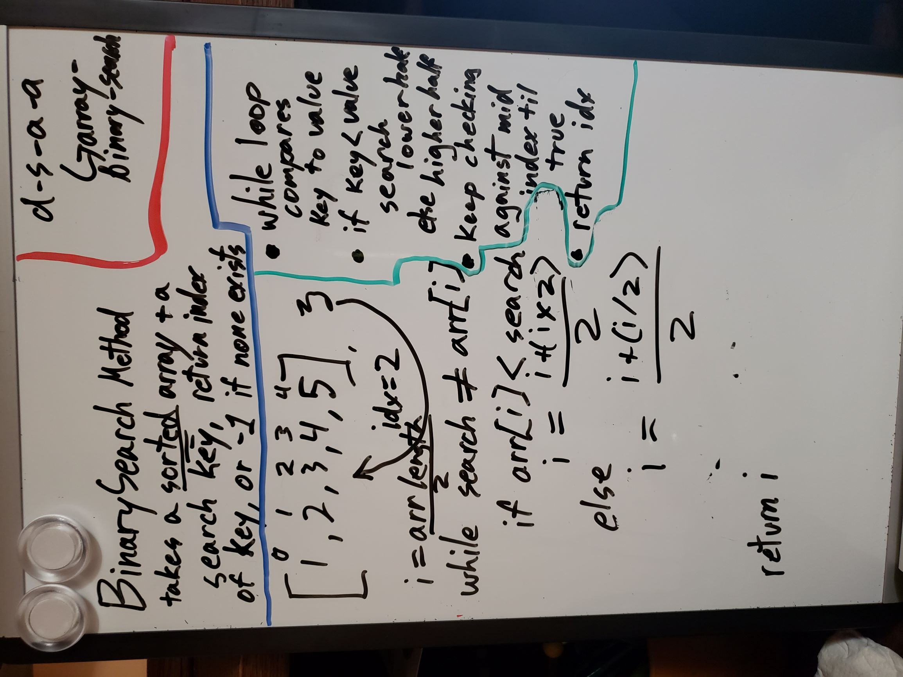

# Challenge Summary
Find a matching value in a sorted array

## Challenge Description
Create a method called BinarySearch that takes a sorted array and a search key as arguments,  
and finds the value that matches the key in the array, and returns its index number. If it does not find the value, it should return `-1`. Do Not use any built in C# methods,  
and make sure to thoroughly unit test your method.

## Approach & Efficiency
- make an index variable to use, taking the middle of the array first
- Make a while loop, testing the key against the array at your middle index
- using three `if/else` statements, check for:
  - if the index has reached the beginning or end without a match, return `-1`.
  - if the value at the index is greater than the key, change your index to halfway between 0 and the old index
  - if the value is less than the key, make your index move halfway between its old number and the array length.
- eventually the while will return either the correct index, or `-1`
I used this approach because it required the least "code logic", 
this form of sorting and searching an array is all math. 
It's simple enough that I don't feel worried about the strain 
that my while loop might incur. Checking if the value didn't exist
turned out to be much simpler than I expected though. 
Since there are only two directions the index can move, 
eventually it'll either make a match or leave the array bounds 
without passing the while condition

In Big O notation, I think this would count as O(N/2). is that a thing?

## Code
[Go See The Code!](./BinarySearch/Program.cs)

## Solution
