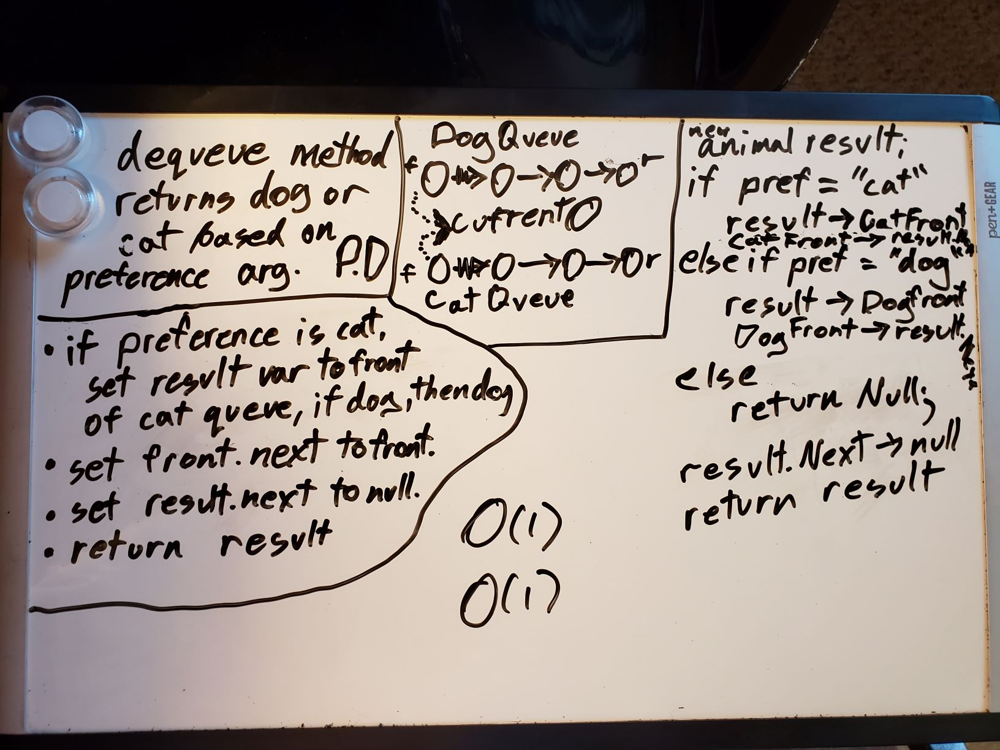

# FIFO Animal Shelter
Create an Animal shelter Class that queues up dogs and cats to be adopted

## Challenge
Create An Animal Shelter Class. It should be able to enqueue animals, either dogs or cats, and should be able to dequeue them back to the method call when given a preference of type. If possible, the dequeue method should also return the first animal if no type is specified

## Approach & Efficiency
Because it didn't specify how the inner workings of the animal shelter were meant to operate. I set it up as two queues. one for dogs one for cats. What this means is, no matter how long my animal queue gets, my enqueue and dequeue methods will never take up more time or space, making them O(1) methods. I also gave my animal classes an Id number, to keep track of how long they've been waiting in the animal shelter.

### Visual

## API
Animal Shelter
- Enqueue: Adds a new Animal of either Dog or Cat type to the Rear of the Queue
- Dequeue: Removes the Front Animal of the Queue, unless a preference is set, then it finds the first match to that preference and removes and returns it.