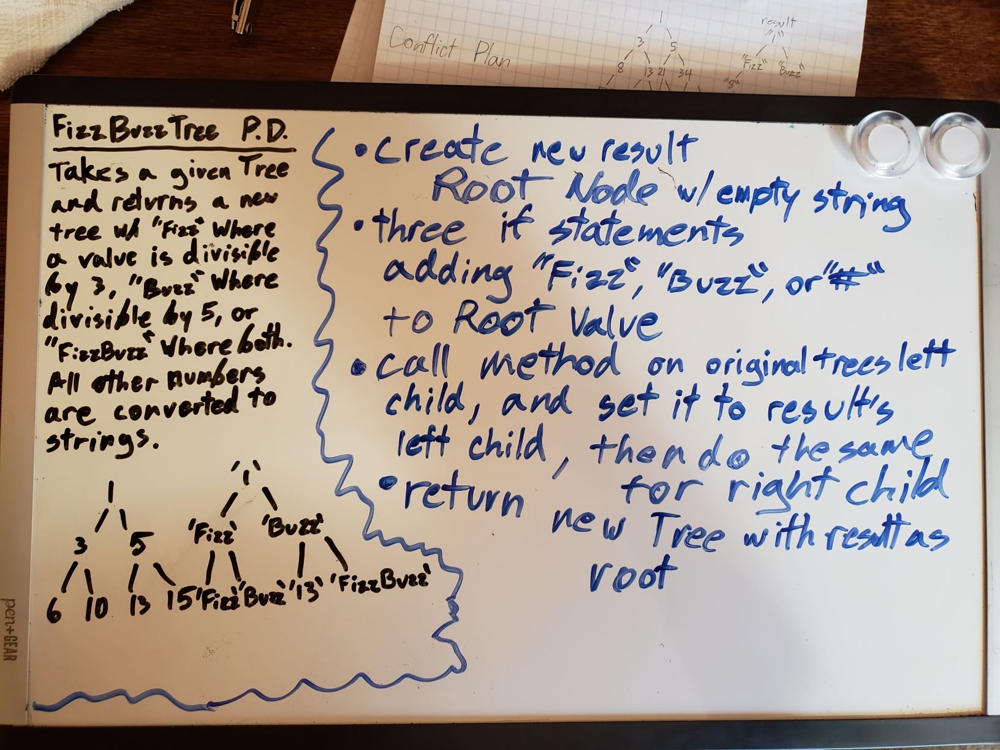
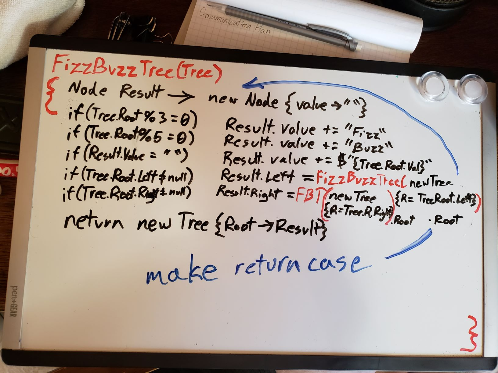

# FizzBuzz Tree
Create A new Method that will convert a normal binary tree into a fizzbuzz tree via the following specifications.

## Challenge
Create a new FizzBuzz Method, that takes a binary tree and returns a new tree, with strings in place of the old values. these strings should be "Fizz" if the original value was divisible by 3, "Buzz" if it was divisible by 5, or "FizzBuzz" if it was divisible by 15. All other integers should be converted directly to strings (`1 = "1"`)

## Approach & Efficiency
Much more satisfied this time around than my first stab at tree traversal. I believe my method is as efficient as possible, so far as I can tell, taking O(N) space unfortunately, due to all the tables created from the recursive method calling, and O(N) time.

### Visual

  
*Thanks to Joseph Hangarter for White Boarding and Collaboration*  

[__CHECK OUT THE CODE__](FizzBuzzTree/Program.cs)
