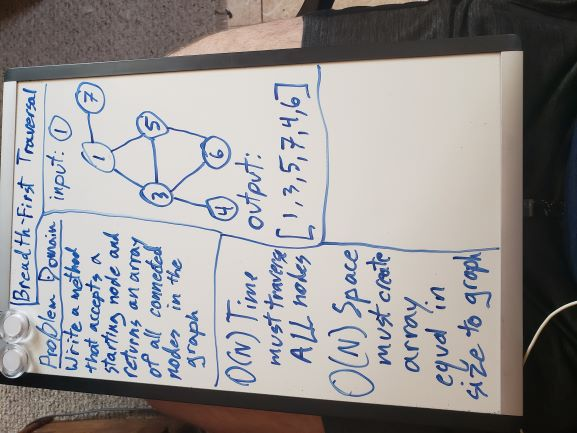
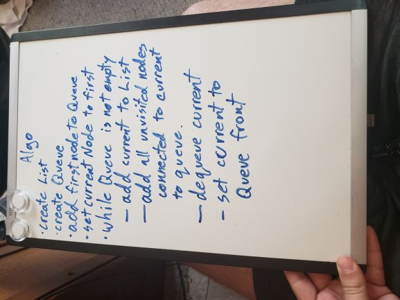
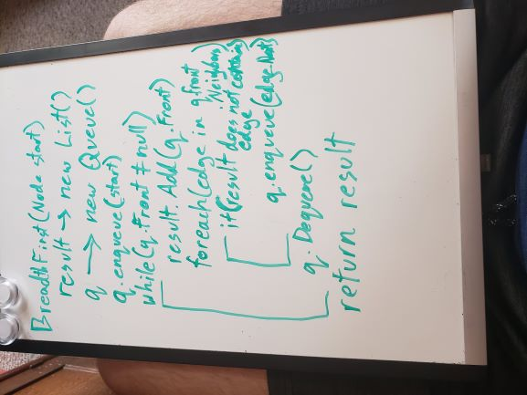

# Graphs
A Graph is a non-linear data structure consisting of vertices (nodes) and edges. A node is a container for a single value. An edge can be directed from one node to another, or undirected, just connecting two nodes. an edge can also have a weight.

## Challenge 1
Scaffold out and test a Graph data structure, building off of our in-class demo code.

## Challenge 2
Build a breadth first traversal method that takes in a starting node and traverses all connected nodes in the graph from there.

## Approach & Efficiency
- **BreadthFirst**:  
    Takes a starting node and traverses all outgoing edges from that node, returning all downstream nodes in the graph.
    **O(N) Time + Space**

- **AddNode**:  
    Create a new node with the given value, then create a new list of edges for it, and pass them into the adjacency list. Increment the graph's size, and return the new node.  
    **O(1) Time + Space**

- **AddEdge**:  
    Create a new edge with node b and the specified weight, then add that edge to node a's list of edges.
    Return the new edge.  
    **O(1) Time + Space**

- **GetAllNodes**:  
    Create a new Node list, then for each entry in the adjacency list, add one node to the new list. Check if the graph is empty, then return the list.  
    **O(N) Time + O(1) Space**

- **GetNeighbors**:  
    Just return the adjacency list where the key is the passed in node.  
    **O(1) Time + Space**

- **Size**:
    Return Size property.  
    **O(1) Time + Space**

## API
- **AddNode()**: Add a New node to the graph
- **AddEdge()**: Create a new edge between two nodes
- **GetAllNodes()**: Return all nodes in the graph
- **GetNeighbors**: Get all the neighboring edges connected to a given node.
- **Size**: Return the number of values in the graph.

## Whiteboards

[__CHECK OUT THE CODE__](Graphs/Classes/Graph.cs)