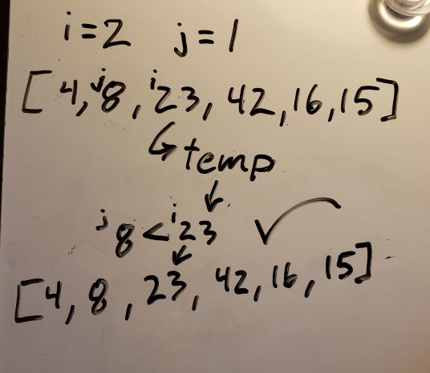
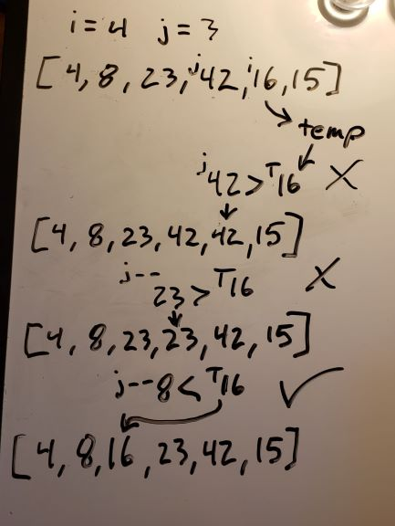

# Insertion Sort Method
## Algorithm
Insertion Sort is a sorting algorithm that moves through an array, comparing two values next to each other, and swapping them so that the lower value comes first. It then moves incrementally backwards to the beginning of the array, swapping values wherever necessary, so that the array is incrementally sorted.

## Pseudo Code
```
InsertionSort(int[] arr)

    FOR i = 1 to arr.Length

        int j <-- i - 1
        int temp <-- arr[i]

        WHILE j >= 0 AND temp < arr[j]
            arr[j + 1] <-- arr[j]
            j <-- j - 1

        arr[j + 1] <-- temp
```
## Trace
Sample Array: `[8,4,23,42,16,15]`

### Pass 1
In the first pass, we set index 1 to a temporary variable. Then, while index 1 is smaller than index 0, we set index 1 to the value of index 0, we break out of the loop, and we set index 0 to our temporary variable, the original value of index 1.


### Pass 2
In our second pass through, we set index 2's value, 23 to our temporary variable, but since it is not smaller than index 1, we don't enter the while loop, and we reset index 2 to 23 (essentially, no changes).


### Pass 3
In our third pass, index is now 3, but since index 3, 42, is not smaller than index 2, 23, there are once again no changes.


### Pass 4
With our index at 4, the value 16 is set to our temp variable, and since it is smaller than 42, we enter the while loop. We set index 4 to 42 instead, and decrement our indexer. Since 16 is also smaller than 23, we set index 3 to 23, and decrement our indexer again. Now, 16 is LARGER than 4, so we break out of the while loop, and set index 2 to our temporary variable, 16.


### Pass 5
On our final pass, our index 5 value, 15, is set to the temp variable. This time we go through the while loop 3 times, comparing 15 to 42, then 23, and then 16, set each value one index higher as we do. When we reach index 1, 4, we break the while loop since 4 isn't larger than 15, and set 15 to the index above that, 2.


[__CHECK OUT THE CODE__](InsertionSort/Program.cs)
