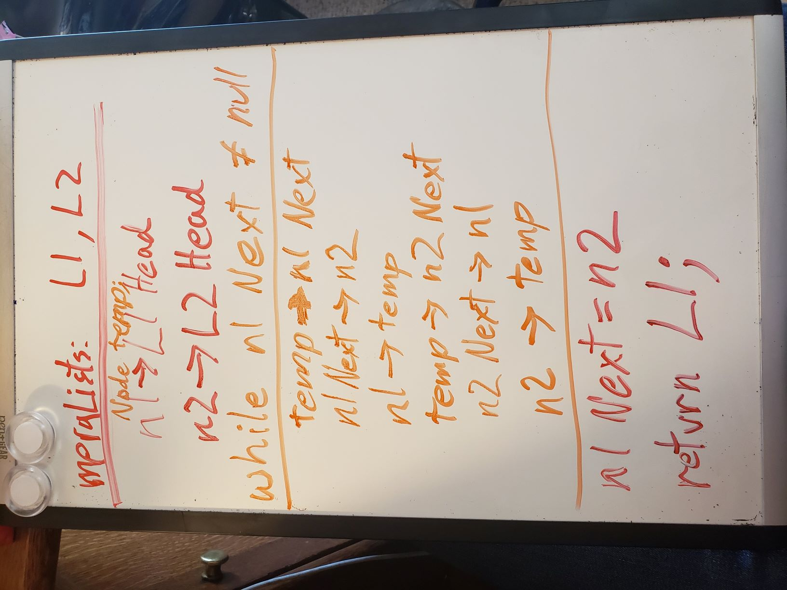
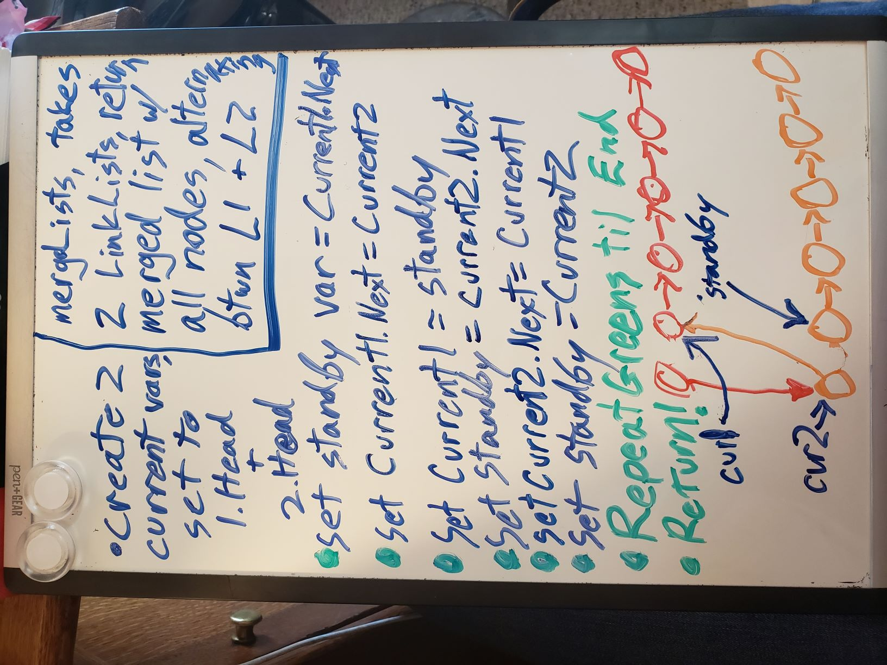

# Challenge Summary
Build a Method that will join two link lists together into one long link list, alternating between each of their nodes

## Challenge Description
Create a method that, given two link lists as input will return a link list where every other node is from list 1, while every node in between is from list 2. Try to keep your space efficiency in O(1) territory

## Approach & Efficiency
Thinking about space efficiency, I figured out all I needed was three variables that could, for lack of a better word, braid the nodes together without losing track of the rest of whichever list was disconnected at the time. I built in a temp variable that would hold the disconnected node while my current 2 nodes attached one's next property to the other. It's confusing to look at, and I have to read the whole thing to figure out any bug that shows up, so Human efficiency is totally not great, but it is in O(1) space, and only O(N) time. I also added in some if statements incase one or both lists were empty, or if one list was longer than the other, so it should account for any mistaken or misleading input.

## Solution
Ran out of room, so I have two whiteboard images:

