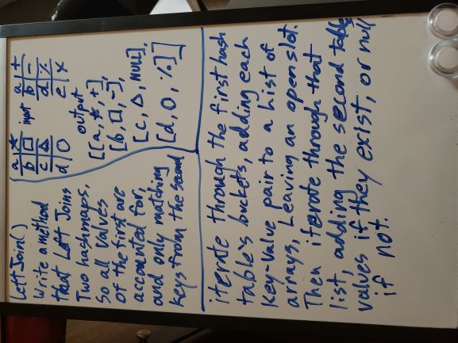
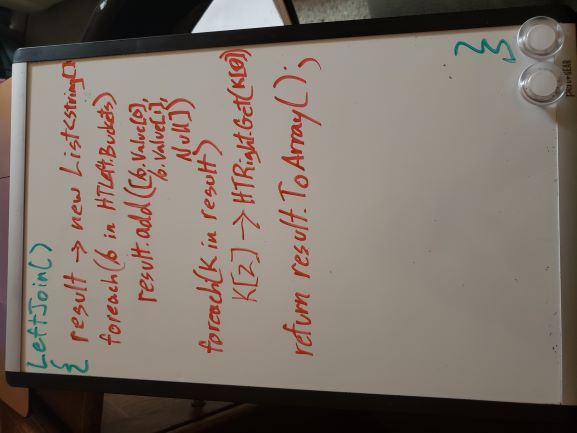

# Challenge Summary
A method that LeftJoins two hashtables

## Challenge Description
- Write a function called LeftJoin that takes two hashtable parameters.  
- Combine the key and corresponding values (if they exist) into a new array according to LEFT JOIN logic.  
- LEFT JOIN means all the values in the first hashmap are returned, and if values exist in the second hashmap, they are appended to the result row.  
- If no values exist in the right hashmap, then NULL should be appended instead.  

## Approach & Efficiency
I knew I would have to go through the first hashmap a full time, so I made my hashmap's "buckets" publicly accessible. Then for each bucket I iterated through the linked list, adding each key and value to the first and second strings in an array of three, and set the third to null. So that makes it officially O(N) time, and O(N) space since I had to create a new list for those arrays to be returned in. The left hashmap was easier, because now I had access to the array, I could go through it and call compare and get on the second hashmap to check in constant time if they even existed and then replace the third index with them if so.

## Code
[Go See The Code!](./LeftJoin/Program.cs)

## Solution

