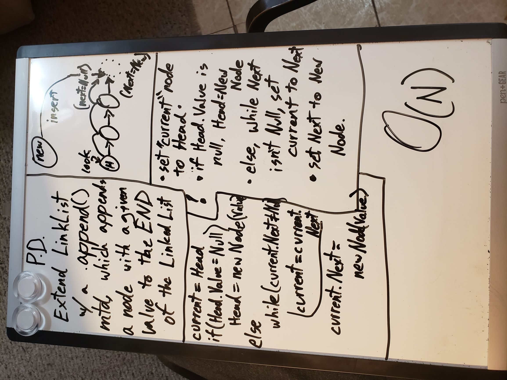
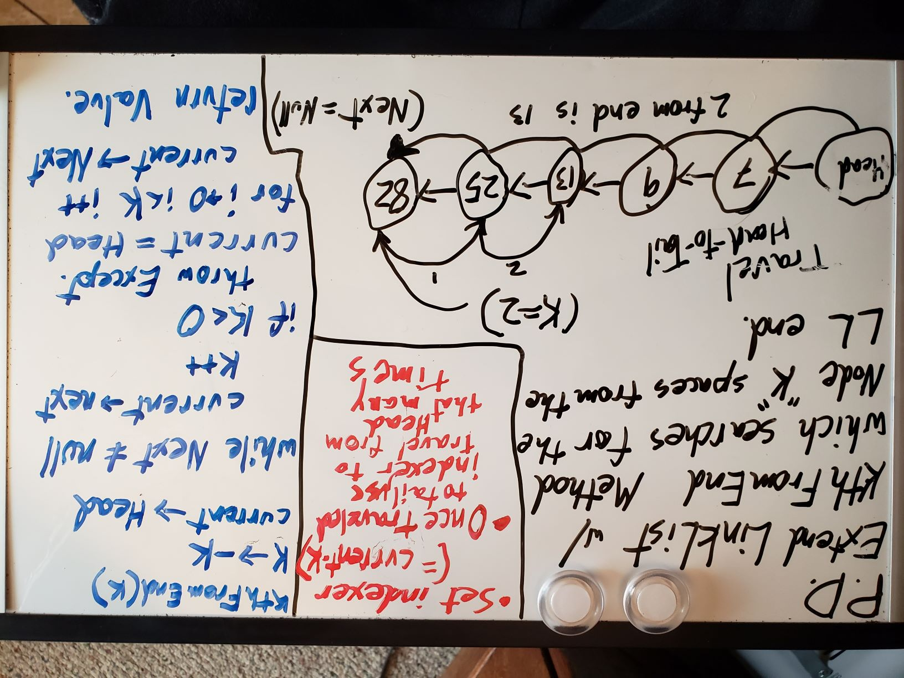

# Singly Linked List
A Singly Linked List is a list, populated by nodes of data. these nodes can only interact directly with their next node in line,
this means one must traverse the Linked List in a single direction (i.e. "Singly") from head to toe.
[Part 1](## Challenge Day 1)  [Part 2](## Challenge Day 2)  [Part 3](## Challenge Day 3)

--- 

## Challenge Day 1
1. Create two classes, a linked list class and a node class.
    - A node class should contain a value property and a next property. In this case, the data type of value should be int, and next should always be another node.
    - A LinkList class should contain a Head property of type Node.
2. Build three methods within LinkList that allow you to interact with the list.
    - Build an Insert method that will take a node as a parameter, and insert it at the head of the linklist, moving all other nodes further down the line, and making sure the previous head is assigned to the new heads "Next" property.
    - Build an Includes method that takes a value as a parameter and returns a boolean depending on whether that value exists within the Linked List as a node's value.
    - Build a ToString method that puts together a readable string representation of the Link List, in this format:
    ` "{ a } -> { b } -> { c } -> NULL" `
3. Test thoroughly and catch any unhandled exceptions effectively.

### Approach & Efficiency
I started immediately with the provided tests, and built classes, properties, and methods as I needed them. I think this made my methods much more efficient. Check out the Insert method, in O(1) time! Two lines, no chance to throw an exception, with heavy test coverage. The other two methods came in O(N) time, which is understandable, because both need to check every node in the list, so they grow evenly with the length of the LinkList.

### API
`LinkList.Insert()` | Inserts a new node at the beginning of a linked list, assigns it to head, and assigns the previous head to the new node's "next" prop.
`LinkList.Includes([int])` | Using a While loop, Checks if a given Value is represented anywhere in the linked list's nodes. returns true if it finds a matching value.
`LinkList.ToString()` | Returns a formatted string of all the values of nodes in your list.  
    Format: `"{ a } -> { b } -> { c } -> NULL"`

## Challenge Day 2
Building off of yesterday's linked list, create three more methods to modify your linked lists.
- Create an Append method, which will add a new node with a given value to the END of the LL.
- Create an InsertBefore method, which will add a new node with a given value before the first node it finds that matches a separate search value.
- Create an InsertAfter method, which will add a new node with a given value after the first node it finds that matches a separate search value.
- STRETCH: Create a Delete method, which will delete the first node it encounters whose value matches a given search value.

### Approach & Efficiency
Because all of these methods, unlike our original insert method, need to search through the linked list to find their match, or in appends case, find the tail of the list, they all made use of a single while loop. In big O time, they would all be a O(N) rank method. However, I think since they use the same variable to traverse one node to the next, space-wise they would be O(1)??
### Solution

## Challenge Day 3
Further Extending the LinkList class, create a method called `KthFromEnd()` That recieves an integer *k* as the input and searches your linked list for the corresponding node that is *k* nodes from the end. It should also throw custom exceptions if *k* is out of the range of the linked list, whether it be too high, or less than 0.

## Approach & Efficiency
The way I built this method, you have to traverse the linklist twice through. Once to find the end, and again to find the searched for node. Since I can only access nodes further down the line, I had to start over __After__ finding the end, so there was no way to do it all in one loop. This left me with a method in 0(N) Time, but that takes twice the time a single loop would

## Solution

#### CHECKOUT THE CODE
[CODE LINK](https://github.com/HCoggers/data-structures-and-algorithms/blob/master/code-challenges/401/LinkedList/LinkedList/Program.cs) 
