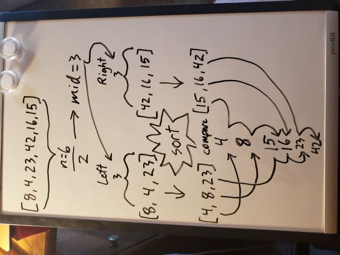
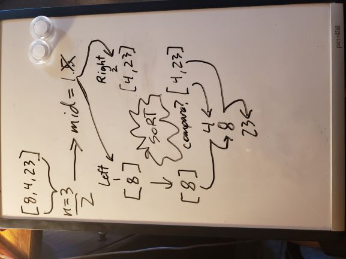
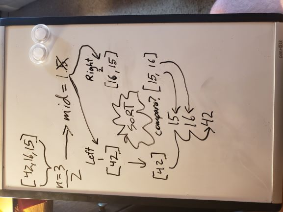

# Merge Sort Method
## Algorithm
Merge Sort is a sorting algorithm that splits an array in two at the center, then uses a Merge "satellite" method to put them back together in a sorted order. The Merge method will compare the left and right sides of the array, replacing the index in the original array with the lower of the two values as it iterates through. Merge Sort calls itself recursively on each side array until the divided up arrays are only one index long, then sorts them, progressively merging them back together as it moves back down the call stack. 

## Pseudo Code
```
ALGORITHM Mergesort(arr)
    DECLARE n <-- arr.length
           
    if n > 1
      DECLARE mid <-- n/2
      DECLARE left <-- arr[0...mid]
      DECLARE right <-- arr[mid...n]
      // sort the left side
      Mergesort(left)
      // sort the right side
      Mergesort(right)
      // merge the sorted left and right sides together
      Merge(left, right, arr)

ALGORITHM Merge(left, right, arr)
    DECLARE i <-- 0
    DECLARE j <-- 0
    DECLARE k <-- 0

    while i < left.length && j < right.length
        if left[i] <= right[j]
            arr[k] <-- left[i]
            i <-- i + 1
        else
            arr[k] <-- right[j]
            j <-- j + 1
            
        k <-- k + 1

    if i = left.length
       set remaining entries in arr to remaining values in right
    else
       set remaining entries in arr to remaining values in left
```
## Trace
Sample Array: `[8,4,23,42,16,15]`

### Call 1
In the first call on the stack, we set a variable `n` to the array length (6) for easy use. Since the length is greater than 1, we then set a `mid` variable equal to half of the array length (3). Then, we create a `left` array with indexes 0 to mid: `[8,4,23]`, and a `right` array with indexes mid through the array length: `[42,16,15]`.  
Then we call this method recursively on the [left](#Call-1/1) side...  
Then we call the method again on the [right](#Call-1/2) side...  
Now, when we call merge on our two sorted sides and our original array, it will add the lesser value as it iterates through the two sides to the next index of the original array. So...
- [0] becomes 4, because 4 is less than 15, 
- [1] becomes 8, as 8 is less than 15, 
- [2] becomes 15, as 23 is more than 15,
- [3] becomes 16, as 23 is more than 16,
- [4] becomes 23, as 23 is less than 42,  
and since the left iterator then hits its length, we can set the rest of the full array, [5], to the remaining value in the right array, 42!   


### Call 1/1
In our left call, `n` will be 3, and since it's still greater than 1, our `mid` variable is going to be 1 (ints will not divide into decimals). We create a new `left` array: `[8]`, and a new `right` array: `[4,23]`. Once more, we call the method on the left side. Since the left's length is just 1, we don't enter our if statement, and the method call completes, performing no logic. Then we call the method on the [right](#Call-1/1/2) side...  
Now that that has been sorted and merged, we can merge left and right back together. Using our three iterators (full, left, right), we check index 0 on the left array against index 0 on the right array. Since 8 is greater than 4, we set the index 0 of the full array to 4, and increment the right array's and the full array's iterator. Now we check 8 against right's index 1, 23. It is less, so we set 8 to index 1 in the full array, increment the left and full iterators, and are broken from the while loop. Since the left's iterator has reached its length, the final index in the array takes the right's remaining value, 23. The method completes, and we return to our first call.  


### Call 1/2
In our right call, we split the main array into `left`: `[42]`, and  `right`: `[16,15]`. We call the method on the left side. Since the left's length is just 1, we don't enter our if statement, and the method call completes, performing no logic. Then we call the method on the [right](#Call-1/2/2) side...  
Now that right has been sorted and merged, we can merge left and right back together. We check index 0 on the left array against index 0 on the right array. Since 42 is greater than 15, we set the index 0 of the full array to 15, and increment the right array's and the full array's iterator. Now we check 42 against right's index 1, 16. It is still more, so we set 16 to index 1 in the full array, increment the right and full iterators, and are broken from the while loop. Since the left's iterator hasn't reached its length, the final index in the array takes the left's remaining value, 42. The method completes, and we return to our first call, having sorted the right array: `[15,16,42]`.  


### Call 1/1/2
This array: `[4,23]` is 2 long, so it is split in two again. Left is `[4]`, and right is `[23]`. Since neither of these are longer than 1, our recursive calls won't enter our if statement, and no logic will be performed. We may now move on to Merge, which will set three iterators, one for the main array, one for left, and one for right. While both the left and right iterators have not reached their lengths (both are currently 1), we will check if left index is less than or equal to the right. Since it is (4 < 23), we can set the current main array index back to 4. Now we increment the left's iterator, and that breaks us out of the while loop. Since the left's iterator has reached the left array's length, we are also free to set the rest of our main array to the rest of the right array, so we set index 1 back to 23. This closes out the method.

### Call 1/2/2
This array: `[16,15]` is 2 long, so it is split in two again. Left is `[16]`, and right is `[15]`. Since neither of these are longer than 1, we may move straight to Merge, where we enter the while loop and check if left index is less than or equal to the right. Since it isn't (16 > 15), we can set the current main array index to 15. Now we increment the right's iterator, and that breaks us out of the while loop. Since the left's iterator hasn't reached the left array's length, we can set the rest of our main array to the rest of the left array, so we set index 1 to 16. This closes out the method with the two values swapped: `[15,16]`.

[__CHECK OUT THE CODE__](InsertionSort/Program.cs)
