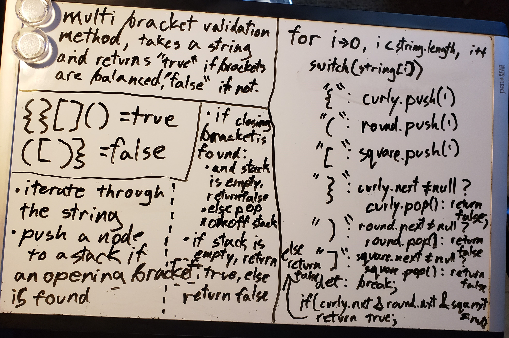

# Challenge Summary
A Method That validates proper use of brackets in a string.

## Challenge Description
Write a Method that takes a string as its input and uses stacks and/or queues' behaviors to validate whether every opening bracket in the string has a matching closing bracket of the same variety later on. It should also not have extra closing brackets without matching opening brackets.

## Approach & Efficiency
I used a stack instance for each type of bracket, to keep them separate. my method adds a node every time a bracket opens, and removes it when that's properly closed. it also checks if any closing brackets are used while the corresponding stack is empty. if all the stacks are empty at the end, the string works!

## Solution

