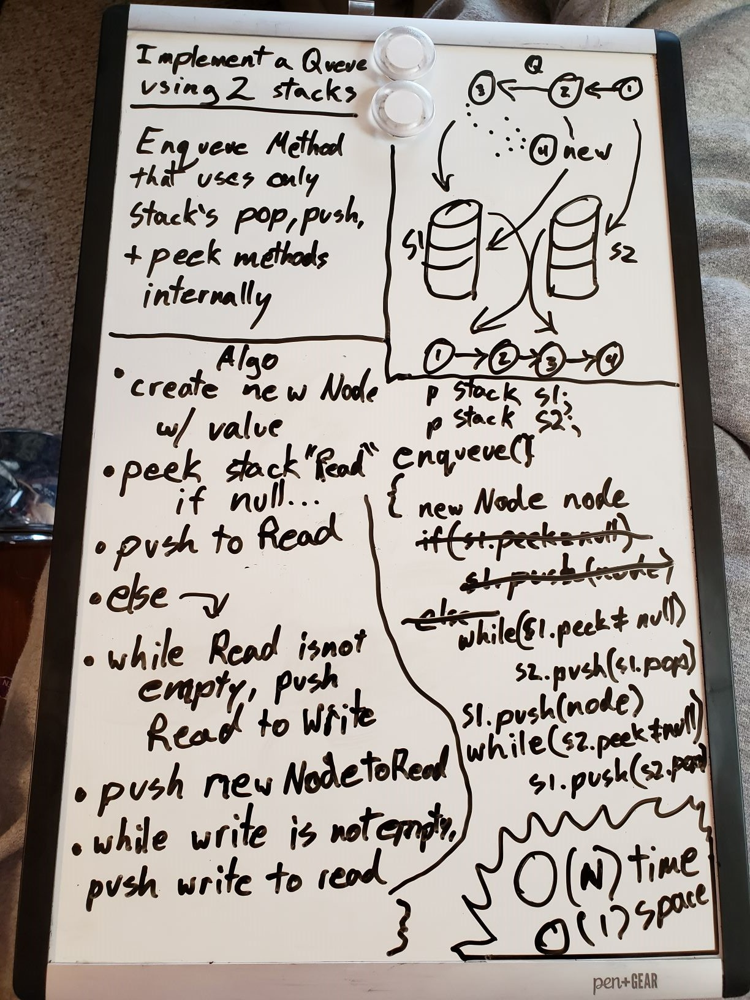

# Queue with Stacks
Create a PseudoQueue class with queue behaviors, but using 2 internal stack objects.

## Challenge
Create A Pseudoqueue Class, which has the basic functionality of a queue, but internally uses to intantiated stacks to perform all of its logic. Create two methods:  

1. An Enqueue method, which will add a given value as a new node at the rear of your queue.  

2. A Dequeue method, which will remove the front node in your queue, and return its value to the caller.

## Approach & Efficiency
While whiteboarding, I thought of the idea to use one stack as a so-called "Read" stack, which would represent the basic structure of the queue at the end of any method calls, and a "Write" stack, which would be used only in method logic to reorganize the nodes to properly enqueue and dequeue, before returning them to the Read stack. I ended up with O(N) time efficiency and O(1) space efficiency, and I think that's the best that can be hoped with no hard-coded values!

### Visual

## API
PseudoQueue
- Two private stack objects. They should start empty when the Pseudoqueue is instantiated.
- Enqueue: Adds a new node with the given value to the Rear of the PseudoQueue
- Dequeue: Removes the Front node of the PseudoQueue

[CHECK OUT THE CODE](QueueWithStacks/Classes/PseudoQueue.cs)
