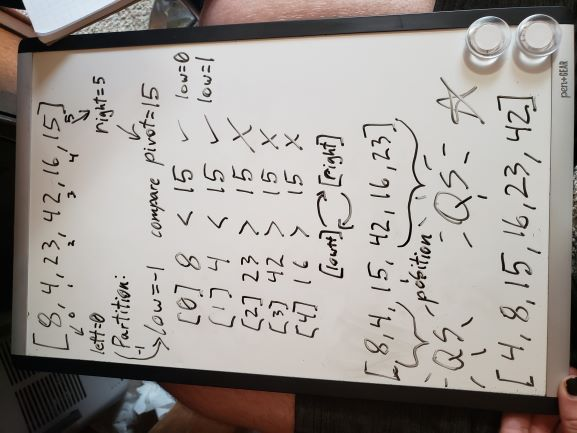
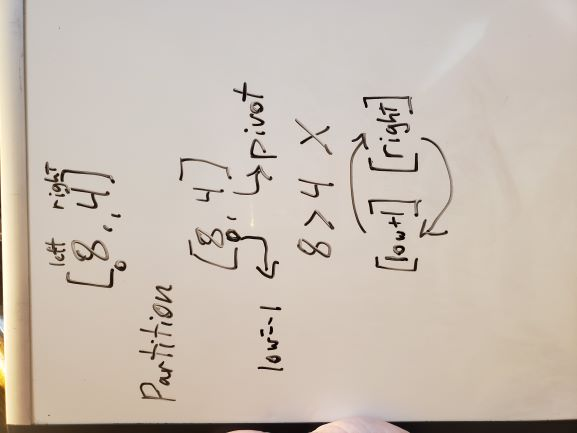
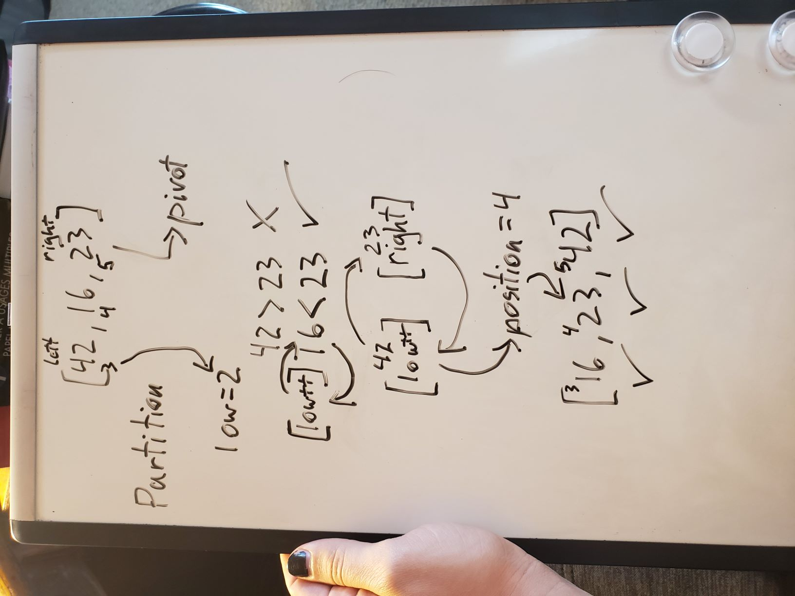

# Quick Sort Method
## Algorithm
Merge sort takes an array, and sorts it by halves, finding where in the array one value should be, and then swapping all the higher numbers to the right side of the array, and all the lower numbers to the right, then sorts those halves again by halves, recursively. It uses a partition satellite method to find where the last value in each array should fit, then swapping all the other values around to the right halves with a second Swap method.

## Pseudo Code
```
ALGORITHM QuickSort(arr, left, right)
    if left < right
        // Partition the array by setting the position of the pivot value 
        DEFINE position <-- Partition(arr, left, right)
        // Sort the left
        QuickSort(arr, left, position - 1)
        // Sort the right
        QuickSort(arr, position + 1, right)

ALGORITHM Partition(arr, left, right)
    // set a pivot value as a point of reference
    DEFINE pivot <-- arr[right]
    // create a variable to track the largest index of numbers lower than the defined pivot
    DEFINE low <-- left - 1
    for i <- left to right do
        if arr[i] <= pivot
            low++
            Swap(arr, i, low)

     // place the value of the pivot location in the middle.
     // all numbers smaller than the pivot are on the left, larger on the right. 
     Swap(arr, right, low + 1)
    // return the pivot index point
     return low + 1

ALGORITHM Swap(arr, i, low)
    DEFINE temp;
    temp <-- arr[i]
    arr[i] <-- arr[low]
    arr[low] <-- temp
```
## Trace
Sample Array: `[8,4,23,42,16,15]`

### Call 1
In the first pass, we pass in the array (`[8,4,23,42,16,15]`), its left most index (`0`), and its right-most index (`5`) as arguments. Since left is less than right, which it will be for any array longer than 1 index (which shouldn't need sorting anyway), we enter an if statement, where we set a `position` variable to the result of our satellite `Partition()` method, passing in those same array, left, and right variables.  
The Partition method is going to create a `pivot` variable from the value of our array at right (`15`), then set a low variable to one less than our left index (`-1`). Then we iterate through the array, and whenever the array value is less than or equal to pivot, we increment the low variable, and swap whichever value we are at with the value at the low index.  
- So our first time through, index 0 (`8`) *is* less than 15, so we increment low to `0` and swap the value at that index with 8. Since index 0 *is* 8, no change.  
- Index 1 (`4`) is also less than 15, so we increment low to `1`, but once again swapping changes nothing.
- Index 2 (`23`) is *more* than 15, so low is not incremented and nothing is swapped. 
- Index 3 (`42`) is more than 15, so no changes.
- Index 4 (`16`) is more than 15, so no changes.

We now want to swap the value at right (15) with the value at low +1 (23). Our array is now sorted by halves (`[8,4,15,42,16,23]`), where the left half is smaller than the right half, and our incremented low variable (`2`) is returned to QuickSort as the `position` variable.  
Back in QuickSort, we now call Quicksort Recursively on our [left](#Call-1/1) and [right](#Call-1/2) arrays, leaving the value at the position index (15), where it is. After the recursive calls complete, our array is sorted properly.  


### Call 1/1
In Quicksorting the left array (`[8,4]`), we set `position` to the result of our `Partition()` method, passing in the same variables.  
In Partition, `pivot` will be 4, the value at our right index (1), and low will be -1 again. our for loop only goes through once, and since index 0, 8, is greater than 4, no changes happen. However, when we break out of the for loop, we will instantly swap indexes 1 and 0, and return 0 as our `position` to QuickSort. We then perform QuickSort on the left array, but since 0 (left) is not greater than -1 (position - 1), no logic happens. The same occurs when we try to call it on the right array, since 1 (position + 1) is not less than 1 (right). This Call is completed, and our array is now (`[4,8,15,42,16,23]`).  


### Call 1/2
In Quicksorting the right array (`[42,16,23]`), we set `position` to the result of our `Partition()` method, passing in the same variables.  
In Partition, `pivot` will be 23, the value at our right index (5), and low will be 2, our left index minus 1. 
- Our first run through the for loop, index 3, 42, is greater than 23, so no changes happen. 
- Our next run, index 4, 16 is *less* than 23, so low gets incremented to 3, and index 3 (42) swaps with index 4.
Now the for loop is completed, we will swap indexes 5 (right) and 4 (low + 1), and return 4 as our `position` to QuickSort. We then perform QuickSort on the left array, but since 3 (left) is not greater than 3 (position - 1), no logic happens. The same on the right array, since 5 (position + 1) is not less than 5 (right). This Call is completed, and our array is now (`[4,8,15,16,23,42]`).  


[__CHECK OUT THE CODE__](InsertionSort/Program.cs)
