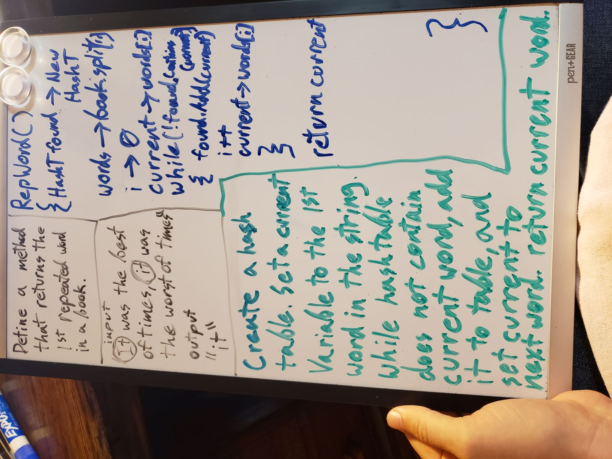

# Challenge Summary
A method that returns the first repeated word in a long string, or else null.

## Challenge Description
Without using any methods built in to C#, create a method that will return the first repeated word in a long string. Call this method inside Main.

## Approach & Efficiency
I created a hash table to store each new word I found, and then iterated through the characters in the string, checking if a word had already been added to the hash array every time I hit a space, and if not, adding that word to the hash table. It's pretty space heavy, since I create a whole 20 index hash table to store the words, but it saves me time in that I only have to iterate through the array once to fully check every word as I go. So, O(N) time, and I suppose O(N) space, since in the worst case I would have to store every single word in the hashtable.

## Solution
