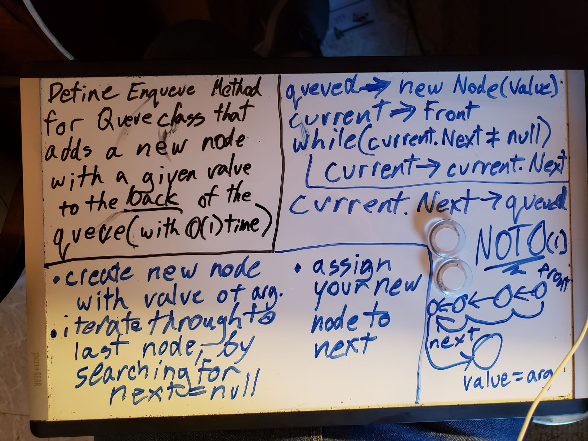

# Stacks and Queues
Create Properties and methods for a Stack and Queue class

## Challenge
Create two new classes:  

1. A Stack Class, that has a Top property of the most recent node added to the stack, a push method to add a new node to the top, a pop method that will either pop off the top node and return the value to the user, or throw an exception if the stack is empty. it also needs a peek method that will either return the value of the top node, or throw an exception if the stack is empty, and an isempty method which will simply return a boolean, true if the stack is empty, false otherwise.  

2. A Queue Class, that has a Front property, and a private rear property, that contain the first and most recent nodes to be enqueued, respectively. It also needs an enqueue method, which will ad a new node to the rear of the queue, and a dequeue method, which will either remove the front node, and return the value to the user, or throw an exception if the queue is empty. It also needs a peek method, which will return the value of the front node, or else throw an exception if the queue is empty, and an isempty method, which will return a boolean whether or not the queue is in fact empty.

## Approach & Efficiency
After whiteboarding out a plan for my enqueue method, I worked test first with these. They all have similar structures to the LinkList methods, with a little different logic each time. It is of note, however, that contrary to my whiteboard planning, I never actually had to go beyond O(1) space OR time efficiency in any of my methods!

### Visual

## API
Stack
- Push: Adds a new node with the given value to the top of a stack
- Pop: Removes the top node of a stack
- Peek: Returns the value of the top node in a stack
- IsEmpty: Returns true if a Stack is empty, false if not.  

Queue
- Enqueue: Adds a new node with the given value to the Rear of a Queue
- Dequeue: Removes the Front node of a stack
- Peek: Returns the value of the Front node in a Queue
- IsEmpty: Returns true if a Queue is empty, false if not.
