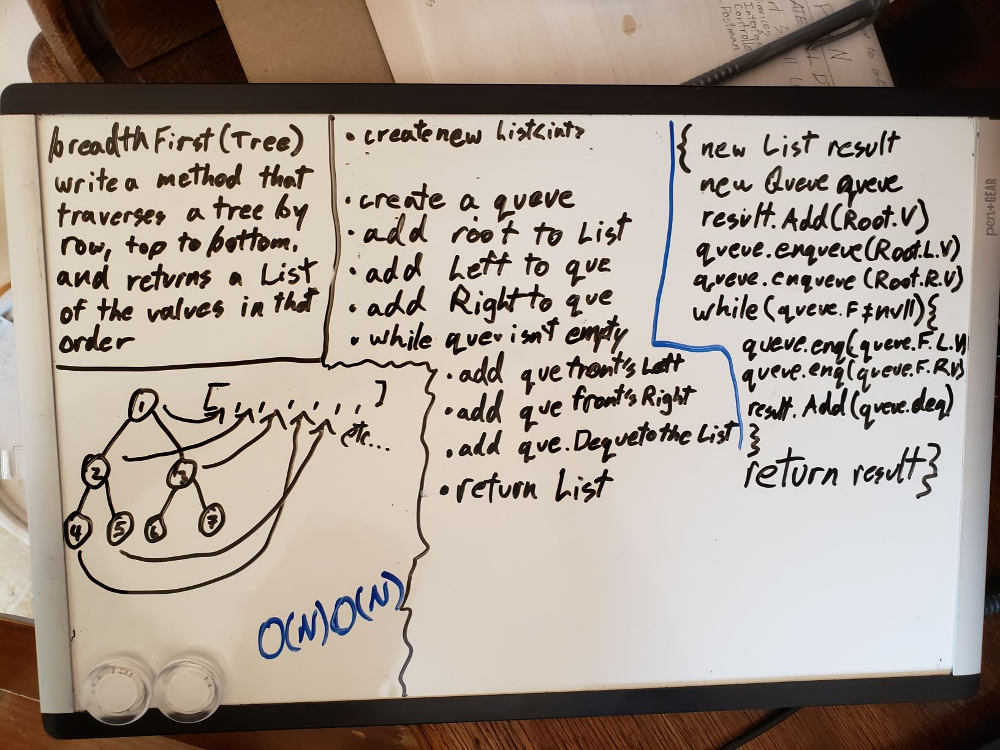
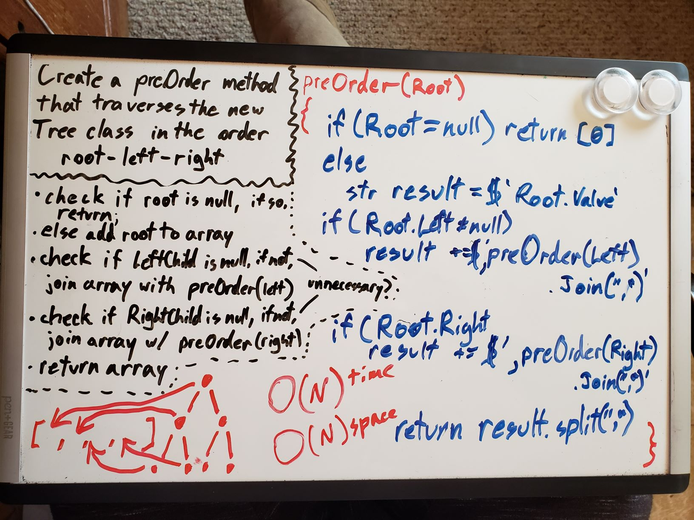

# Tree
Create A new Node Class, a BinaryTree Class, and a BinarySearchTreeClass

## Challenge 2
*Thanks to Andrew Casper for White Boarding Collaboration*
Create a new BreadthFirst Method:
This method should take the tree, and return all its values in order of breadth. this means, if you read your tree like a book, row by row, left to right, and top to bottom, you should come away with the correct order for this method.

## Approach & Efficiency
I didn't use recursion, instead I brought in my Queue class, and added each node I found as i traversed to a queue, that way I could switch between left and right without going all the way down or up again. I did have to edit my enqueue method to take an already realized node instead of just a value, which I would have prefered to refactor into a separate method with more time. As efficient as could be expected, It takes O(N) in both time and space notation.

### Visual

## Challenge 1
Create three new classes:  

1. A new version of the node class. This will hav e a value, property, as well as a left and right child Node property.  

2. A BinaryTree Class. This will have a Root property, as well as thee traversal methods which will return an array matching the correct order of traversal. These orders are PreOrder, InOrder, and PostOrder. The tree should be read either Root-Left-Right, Left-Root-Right, or Left-Right-Root, respectively.

3. A BinarySearchTree Class. This will be similar to the BinaryTree Class, but will have an Add and Contains method that will either add a new node in the appropriate place, by comparing it with the other nodes. or Contains, which will return a boolean if a given value is found anywhere within the search tree.

## Approach & Efficiency
I was very confident with my whiteboard for this one, and even thought I had some ways of shaving down my efficiencies, but when I started coding and testing, I realized nothing quite worked as I expected, and I ran out of time trying to figure out the issue.

### Visual

[__CHECK OUT THE CODE__](Tree/Program.cs)

