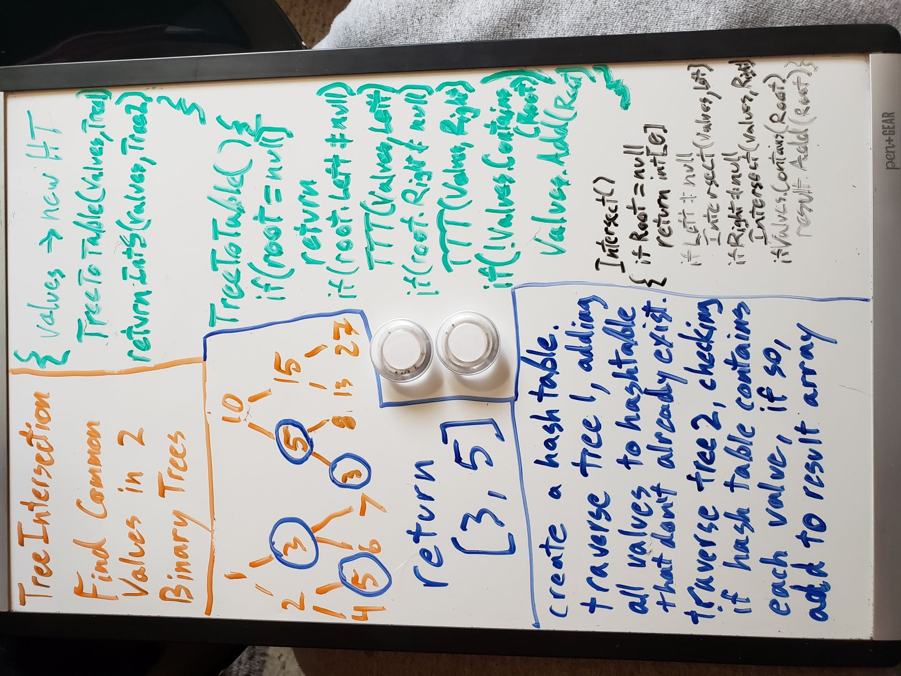

# Challenge Summary
A method that returns a set of common values from two different Binary trees.

## Challenge Description
Write a function called TreeIntersection that takes two binary tree parameters.
Without utilizing any of the built-in library methods available to C#, return a set of values found in both trees.

## Approach & Efficiency
I altered My PreOrder method from when we built binary trees into two sattelite methods. One That could transfer an entire binary tree into a hashtable, and another that could compare another binary tree to that hash table. Because I only had to go through each tree once, I still consider this an O(N) time operation, but I also had to build a full hashtable to take the values, as well as a list to return to the caller, so it's also O(N) space. 

## Code
[Go See The Code!](./TreeCompare/Program.cs)

## Solution
